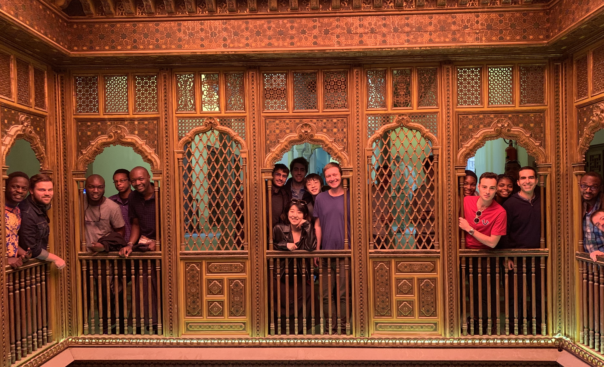

Hui is an AI Research Engineer at <a href="https://www.instadeep.com">InstaDeep</a> . Priviously she gained her Master of Research degree with Distinction from UCL, where she conducted research on multi-agent reinforcement learning with Prof.Jun
                Wang. Before that, she completed the Bachlor degree program in Software Engineer at Wuhan University, ranking top 10%. Hui has the passion for reinforcement learning and multi-agent learning and she is applying her engineering skills to
                creating elegant and powerful learning systems to solve real-world problems.
 

### Contact

 <a href="https://www.linkedin.com/in/hui-chen-argmax/" ><i class="fab fa-linkedin"></i>  </a>
 <a href="https://twitter.com/argmax_hc"> <i class="fab fa-twitter"></i> </a>
<a href="veronicachen0912@gmail.com"> <i class="fab fa-google"></i></a>

